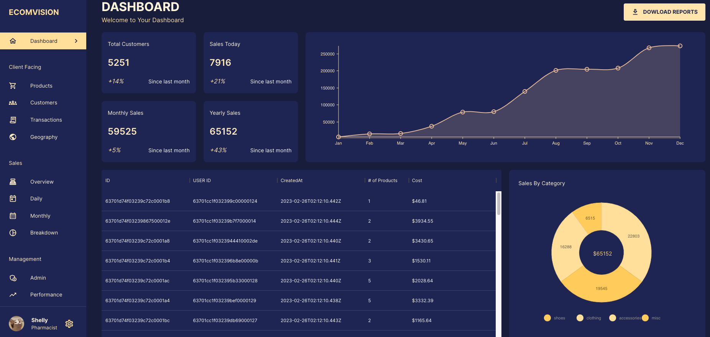

# admin-dashboard
#### MERN fullstack admin dashboard practice
 

[backend server](https://admin-analytics-backend.onrender.com)
 
[frontend](https://admin-analytics-frontend.onrender.com)

 

Built with the following libraries/frameworks:

* MongoDB
* Express.js
* React
* Node
* Redux
* Material UI
* Nivo

 

